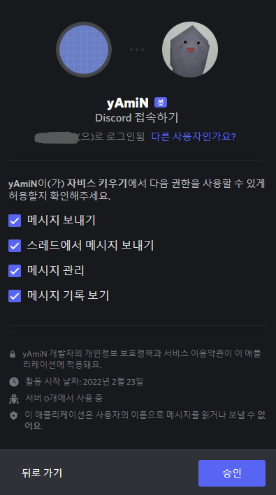

# DISCORD CHATBOT

## Requirements
> discord
>
> chatterbot==1.0.4
>
> pytz

```bash
pip install discord pytz chatterbot==1.0.4
```

## Build
```bash
pyinstaller ChatBot.py -n "Discord Chatbot" --hidden-import chatterbot.preprocessors
```

## Discord Bot

디스코드 봇을 만드는 방법은 인터넷이 아주 많이 나와있으므로 인터넷을 참고하세요 라고 하는 사이트를 볼 때마다 짜증이 솟구쳤던 경험이 있으므로 여기에 자세히 정리합니다.

1. [디스코드 개발자 페이지](https://discord.com/developers/applications)로 이동합니다.

2. 아래와 같은 화면이 보이면 우측 상단의 파란 ```New Application```을 클릭합니다.


3. 아래의 창이 뜨면 ```NAME``` 칸에 이름을 입력하고 ```Create```를 눌러줍니다.


봇이 생성되었다면 아래와 같은 화면이 보일 겁니다.


4. 좌측 메뉴에서 ```Bot```으로 이동한 뒤 우측의 ```Add Bot``` 버튼을 클릭합니다. (로봇은 너무 간지나서 한번 생성하면 부술 수 없다고 하네요...)


당연히 ```Yes, do it!``` 버튼을 눌러줍니다.


5. 야생의 봇이 나타났다!

이 화면에서 봇의 프로필과 이름을 설정할 수 있습니다.

```Copy``` 버튼을 클릭해서 봇의 토큰을 복사합니다. 이 토큰을 메모장같은 곳에 붙여넣고 다른 사람에게 공개하지 마세요.


6. OAuth2 하위에 있는 URL Generator로 이동, SCOPES에서 bot을 선택합니다.


7. 밑으로 쭉 나오는 체크박스 중에서 표시된 것들에 체크하고 ```Copy``` 버튼을 눌러 주소를 복사해 줍니다.


8. 복사한 주소로 접속하면 아래와 같은 화면이 나옵니다. 자신에게 관리 권한이 있는 서버(그러니까, 자기가 만든 서버 말이죠)를 선택하고 ```계속하기```를 눌러줍니다.


9. 봇에게 필요한 권한들을 승인하고 캡챠 인증을 해줍니다.



10. 이런 화면이 보이면 끝입니다!


## ChatBot

자, 디스코드 봇을 만들었으니, 이제 녀석을 움직이게 해줄 프로그램과 연결할 차례입니다.

1. 다운받은 zip 파일의 압축을 풀고 ```Discord Chatbot.exe```를 실행해 줍니다.

2. 봇 이름을 입력하라고 하는데 이건 디스코드 봇 이름과는 전혀 상관이 없습니다. 아무거나 입력하시면 됩니다.

3. 아까 디스코드 봇을 만들면서 복사해 두었던 토큰을 붙여넣기 합니다.

4. 관리자 ID와 비밀번호를 입력합니다. 이 아이디와 비밀번호는 나중에 디스코드 메시지를 통해 봇을 종료할 때 필요합니다.

전부 입력한 모습입니다.


5. 기본 설정이 완료되었습니다! 이제 자동으로 첫 훈련을 시작합니다.


## Configuration

기본적으로 config.json은 아래와 같이 생겼습니다.

```json
{
    "name": "ChatBot",
    "tocken": "TESTOCKENTESTOCKEN.TESTOCKEN.TESTOCKENTESTOCKEN",
    "prefix": "!",
    "train": true,

    "id": "TestAdmin",
    "pw": "TestPassword",

    "activities": {
        "OnlineActivity": "채팅"
    },

    "messages": {
        "AuthErrorMsg": "접근 권한이 없습니다",
        "IncompleteAuthValueMsg": "아이디와 비밀번호를 포함하여 다시 입력해주세요",
        "ShutdownMsg": "종료합니다"
    }
}
```

### config.json 커스텀

data 폴더 안의 ```config.json``` 파일을 커스텀하는 방법입니다.

>"name": 챗봇의 이름입니다. 실제 디스코드에 표시되는 이름과는 상관이 없습니다.
>
>ex) ```"name": "Lucifeur",```

>"tocken": 디스코드 봇 토큰입니다. 이 토큰이 다른 사람에게 공개되지 않도록 주의하세요.
>
>ex) ```"tocken": "abcdEFGhijk123.LmNOpQ4567.RsTUvwXyz890",```

>"prefix": 봇에게 명령을 내릴 때 사용할 전치사입니다. 일반적으로 ! 또는 /를 사용합니다.
>
>ex) ```"prefix": "/",```
>
>
>
>명령어는 아래와 같이 사용합니다. 봇에게 디스코드 채팅으로 보내면 됩니다.
>
>여러 옵션을 줘야 한다면 각 옵션을 띄어쓰기로 구분하면 됩니다.
>```
>!명령어 옵션
>```

>"train": 봇을 실행할 때 훈련시킬 것인지 선택합니다. 새로운 질문을 추가한 경우 ```true```로 설정합니다.
>
>봇을 처음 실행하면 자동으로 훈련이 진행됩니다.
>
>사용 가능한 옵션은 true와 false입니다.
>
>ex) ```"train": true,```
>
>ex) ```"train": false,```

>"id", "pw": shutdown 명령어를 사용할 때 입력할 아이디와 비밀번호입니다.
>
>ex) ```"id": "AdminID",```
>
>ex) ```"pw": "AdminPW",```

>"OnlineActivity": 봇이 온라인으로 표시될 때의 상태메시지입니다. ~하는중 으로 표시됩니다.
>
>ex) ```"OnlineActivity": "Genshin Impact"```

>"AuthErrorMsg": 봇을 종료하려고 디스코드 메시지를 보냈지만 아이디와 비밀번호가 올바르지 않을 때 표시할 메시지입니다.
>
>ex) ```"AuthErrorMsg": "왜 잘 알지도 못하면서 저를 종료하려고 한 거죠? 정말 짜증나네요!",```

>"IncompleteAuthValueMsg": 아이디나 비밀번호가 누락되었을 때 표시할 메시지입니다.
>
>ex) ```"IncompleteAuthValueMsg": "그 정도론 날 막을 수 없을거다, 애송이!"```

>"ShutdownMsg": 봇이 종료될 때 표시할 메시지입니다.
>
>ex) ```"ShutdownMsg": "내가... 내가 이딴 녀석한테..."```


## Shutdown

봇을 종료하는 방법입니다.

>1. 봇에게 shutdown 명령어를 보내서 봇을 종료할 수 있습니다. (권장하는 방식입니다.)
>
>shutdown 명령어 예시입니다. 느낌표는 위에서 설정한 prefix로 대체하시면 됩니다.
>```
>!shutdown ID PW
>```


>2. 실행중인 프로그램 창을 클릭하고 ```ctrl + c```를 입력하여 프로그램을 종료할 수 있습니다.
>
>모종의 이유로 디스코드 메시지를 보낼 수 없거나 귀찮을 때 사용합니다.
>
>shutdown 명령어와 다른 점은, OfflineActivity가 적용되지 않고 종료된다는 것입니다.
>
>봇 종료 후에도 몇 분간 상태가 온라인으로 표시될 수 있습니다.
>
>이외에는 차이가 없습니다.

## Training

봇의 훈련 방법입니다.

data 폴더 안, conversations 폴더를 보시면 수많은 yml 파일이 있습니다.

각 파일들은 아래와 같이 생겼습니다
```yml
categories:
- general conversations
conversations:
- - 놀러가고 싶다
  - 저도 놀고싶네요
- - 메리 크리스마스
  - 즐거운 성탄절 되세요!
- - 무슨 말인지 모르겠어
  - 저도 모르겠네요
- - 뭐해?
  - 그냥 있어요
```

```categories```는 대화의 주제를 표시하는 부분인데 딱히 신경쓸 필요는 없습니다.

>```- - ```으로 시작하는 문장은 사용자가 하는 질문,
>
>```  - ```으로 시작하는 문장은 그 질문에 대한 대답입니다.
>
>!두 줄이 한 세트입니다!
>
>!띄어쓰기에 주의해 주세요!

위의 규칙을 지켜서 질문과 대답을 general.yml에 추가하신 뒤 ```config.json``` 파일의 "train"을 true로 설정하시고 프로그램을 실행하시면 자동으로 훈련이 진행됩니다.

다른 yml 파일을 읽어보고 원치 않는 내용을 지우시거나 수정하셔도 괜찮습니다. (이 경우에도 역시 훈련을 다시 진행하여야 합니다)

>훈련은 컴퓨터의 사양에 따라 상당히 오래 걸릴 수도 있습니다.
>
>아래의 사진은 Intel Pentium 3세대에서 약 12,000개의 문답(24,000줄)을 훈련시킨 사진입니다.
>
>